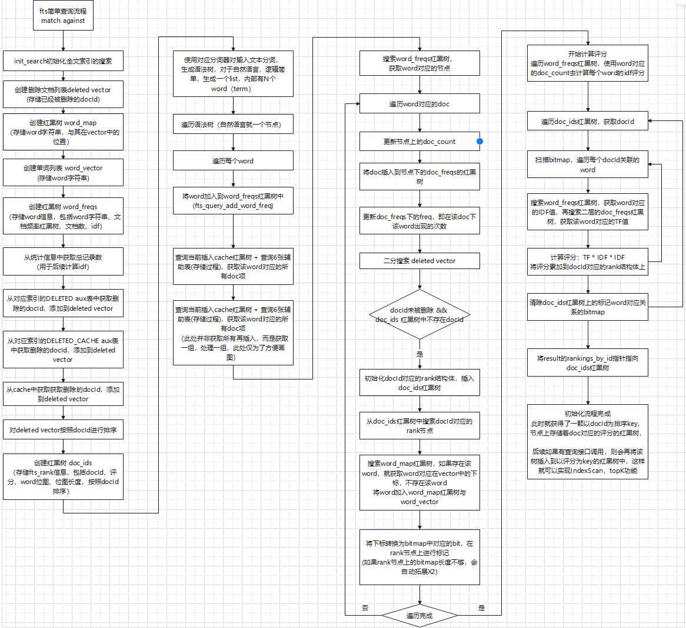

# 关于MySQL数据库fulltext索引的一些梳理

## MySQL特殊事务处理机制验证与分析

在 MySQL 官方文档中存在一个关于数据可见性的特殊描述：

> **InnoDB Full-Text Index Transaction Handling**
> InnoDB full-text indexes have special transaction handling characteristics due its caching and batch processing behavior. **Specifically, updates and insertions on a full-text index are processed at transaction commit time, which means that a full-text search can only see committed data.** The following example demonstrates this behavior. The full-text search only returns a result after the inserted lines are committed.

即 MySQL 是在事务 commit 阶段才完成索引数据的实际写入。所以才会出现：

1. 事务修改，事务内不可见的情况

2. rollback 场景无需考虑，commit 才提交数据，不存在 rollback 的可能

但是真的没有问题吗？例如：

1. 比如 commit 阶段提交数据，也没法保证原子操作，是不是意味着存在一些场景会有不一致问题？

2. commit 阶段可以失败吗？毕竟会涉及磁盘读写等操作，存在失败可能，如果失败整个事务该如何？

下面就对这2个问题进行一些测试与分析

> 使用 MySQL 8.0 进行验证

其实从源码上可以简单看出，其 commit 阶段是不能正常返回错误码的，出现无法处理的错误只能自杀，FTS相关的操作代码嵌入在 commit 函数中，一旦出现了非预期的情况，直接执行 ut_error，这个方法会导致数据库直接中断退出

```cpp
void trx_commit_low(trx_t *trx, mtr_t *mtr) {
  /* undo_no is non-zero if we're doing the final commit. */
  if (trx->fts_trx != nullptr && trx->undo_no != 0 &&
      trx->lock.que_state != TRX_QUE_ROLLING_BACK) {
    dberr_t error;

    ut_a(!trx_is_autocommit_non_locking(trx));

    error = fts_commit(trx);  // FTS相关的操作

    /* FTS-FIXME: Temporarily tolerate DB_DUPLICATE_KEY
    instead of dying. This is a possible scenario if there
    is a crash between insert to DELETED table committing
    and transaction committing. The fix would be able to
    return error from this function */
    if (error != DB_SUCCESS && error != DB_DUPLICATE_KEY) {
      /* FTS-FIXME: once we can return values from this
      function, we should do so and signal an error
      instead of just dying. */

      ut_error;  // 自杀退出
    }
  }
  // ...
}
```

### 验证在 commit 阶段出现异常的场景

测试思路：在进入 commit阶段后，fts_commit 真正执行杀死数据库，这样索引操作并没有真正执行，查看数据库是否符合预期

预置数据

```sql
create table tf1(a int primary key, content text);
insert into tf1 values(1, 'hello');
insert into tf1 values(2, 'hello hello');
create fulltext index idx on tf1(content);

mysql> select *, match(content) against ('hello') as score from tf1;
+---+-------------+----------------------------+
| a | content     | score                      |
+---+-------------+----------------------------+
| 1 | hello       | 0.000000001885928302414186 |
| 2 | hello hello | 0.000000003771856604828372 |
+---+-------------+----------------------------+
2 rows in set (0.01 sec)
```

#### 测试 insert commit 中断崩溃的场景

测试步骤：

1. gdb 设置断点 fts_commit
2. 执行SQL: insert into tf1 values(3, 'hello hello hello');
3. gdb 挂住断点后，kill -9 杀死数据库
4. 重启数据库，查看数据

重启后查询发现结果正常：

```sql
mysql> select *, match(content) against ('hello') as score from tf1;
+---+-------------------+----------------------+
| a | content           | score                |
+---+-------------------+----------------------+
| 1 | hello             | 0.031008131802082062 |
| 2 | hello hello       | 0.062016263604164124 |
| 3 | hello hello hello |  0.09302439540624619 |
+---+-------------------+----------------------+
3 rows in set (0.01 sec)

mysql> select count(1) from tf1 where match(content) against ('hello');
+----------+
| count(1) |
+----------+
|        3 |
+----------+
1 row in set (0.01 sec)
```

虽然索引操作没有执行完成就发生了崩溃，但是依赖于恢复逻辑，在重启数据库后操作ft索引，重新根据数据又生成了索引数据。

#### 测试 delete commit 中断崩溃的场景

**注意：最好是重新创建表，再测试，保证已有数据都sync，才能测试出问题，否则会因为没有sync，重启触发重新插入，此时已删除的数据是不会重插的**

测试步骤：

1. gdb 设置断点 fts_commit
2. 执行SQL: delete from tf1 where a = 1;
3. gdb 挂住断点后，kill -9 杀死数据库
4. 重启数据库，查看数据

重启后查询发现结果不正常：

```sql
mysql> select *, match(content) against ('hello') as score from tf1;
+---+-------------+----------------------------+
| a | content     | score                      |
+---+-------------+----------------------------+
| 2 | hello hello | 0.000000003771856604828372 |
+---+-------------+----------------------------+
1 row in set (0.00 sec)

mysql> select count(1) from tf1 where match(content) against ('hello');
+----------+
| count(1) |
+----------+
|        2 |
+----------+
1 row in set (0.01 sec)

mysql> SET GLOBAL innodb_ft_aux_table = 'test/tf1';
Query OK, 0 rows affected (0.00 sec)

mysql> SELECT * FROM INFORMATION_SCHEMA.INNODB_FT_INDEX_TABLE;
+-------+--------------+-------------+-----------+--------+----------+
| WORD  | FIRST_DOC_ID | LAST_DOC_ID | DOC_COUNT | DOC_ID | POSITION |
+-------+--------------+-------------+-----------+--------+----------+
| hello |            3 |           4 |         2 |      3 |        0 |
| hello |            3 |           4 |         2 |      4 |        0 |
| hello |            3 |           4 |         2 |      4 |        6 |
+-------+--------------+-------------+-----------+--------+----------+
3 rows in set (0.01 sec)

mysql> SELECT * FROM INFORMATION_SCHEMA.INNODB_FT_DELETED;
Empty set (0.00 sec)

mysql> SELECT * FROM INFORMATION_SCHEMA.INNODB_FT_INDEX_CACHE;
Empty set (0.00 sec)
```

当存在回表的场景下，结果正常，但是count(不会表的情况之一)结果明显存在错误，查出来不应该看到的数据，这就不符合 MySQL 文档中的描述，此时原tuple已经不可见，MySQL 认为这次删除已经提交，但是索引数据还是存在。

通过 InnoDB 辅助表，也能看出索引辅助表中还存在已被删除的数据。

##### 为什么会出现这样的情况？

因为删除操作在 fts_commit 函数内会插入删除表，在执行之前core，会导致没有插入删除表，此时ft索引认为这条数据并没有被删除，所以出现了残留。

##### optimize 是否能解决问题？

```sql
mysql> SET GLOBAL innodb_optimize_fulltext_only=ON;
Query OK, 0 rows affected (0.00 sec)

mysql> optimize table tf1;
+----------+----------+----------+----------+
| Table    | Op       | Msg_type | Msg_text |
+----------+----------+----------+----------+
| test.tf1 | optimize | status   | OK       |
+----------+----------+----------+----------+
1 row in set (0.00 sec)

mysql> select count(1) from tf1 where match(content) against ('hello');
+----------+
| count(1) |
+----------+
|        2 |
+----------+
1 row in set (0.01 sec)

mysql> SET GLOBAL innodb_optimize_fulltext_only=OFF;
Query OK, 0 rows affected (0.00 sec)

mysql> optimize table tf1;
+----------+----------+----------+-------------------------------------------------------------------+
| Table    | Op       | Msg_type | Msg_text                                                          |
+----------+----------+----------+-------------------------------------------------------------------+
| test.tf1 | optimize | note     | Table does not support optimize, doing recreate + analyze instead |
| test.tf1 | optimize | status   | OK                                                                |
+----------+----------+----------+-------------------------------------------------------------------+
2 rows in set (0.15 sec)

mysql> select count(1) from tf1 where match(content) against ('hello');
+----------+
| count(1) |
+----------+
|        1 |
+----------+
1 row in set (0.00 sec)
```

因为没有进入删除表，所以 fulltext only 的 optimize 不能解决问题，只有 optimize 整个表才能解决问题（类似于 vacuum full），重新构建。

#### 测试 update commit 中断崩溃的场景

> 对于 fulltext 索引，在 commit 阶段，update = delete + insert 所以不再赘述

## MySQL fulltext 数据丢失问题分析

全文索引中使用插入缓存，每次sync会将缓存中最大的docId作为synced_id下刷，下次恢复会从synced_id开始恢复，在synced_id之前的数据都认为已经下刷完成，不再处理。

此处存在一个问题，在下刷时，作为synced_id的docId一定是正确的吗？
他能够保证在此之前的数据一定下刷了吗？

### 构造场景尝试验证

#### 预置语句

```sql
create table tf1(a int primary key, content text);
create fulltext index idx on tf1(content);

drop procedure if exists gen_test;

delimiter $$

create procedure gen_test()
begin
    declare i int;
    set i = 10;
    while (i <= 50000) do
        insert into tf1 values(i, 'Deleting a record that has a full-text index column could result in numerous small deletions in the auxiliary index tables, making concurrent access to these tables a point of contention. To avoid this problem, the DOC_ID of a deleted document is logged in a');
        set i = i + 1;
    end while;
end$$

delimiter ;
```

#### 测试步骤

1. 开启事务，执行SQL语句

| 事务A | 事务B |
| --- | --- |
| begin; | |
| insert into tf1 values(1, 'hello hello'); | |
| insert into tf1 values(2, 'hello hello hello'); | |
| | call gen_test(); |
| commit; | |

2. 重启数据库

3. 执行SQL语句查询结果

```sql
mysql> select count(1) from tf1 where match(content) against('hello');
+----------+
| count(1) |
+----------+
|        0 |
+----------+
1 row in set (0.01 sec)

mysql> select *, match(content) against('hello') from tf1 limit 2;
+---+-------------------+---------------------------------+
| a | content           | match(content) against('hello') |
+---+-------------------+---------------------------------+
| 1 | hello hello       |                               0 |
| 2 | hello hello hello |                               0 |
+---+-------------------+---------------------------------+
2 rows in set (0.00 sec)
```

#### 分析

查询结果数据存在问题，明明相关的语句，但是评分却=0，判定为不相关。

假设单独插入的两条数据对应的docId为 docId1, docId2

事务A开启时候，执行了 insert 语句，分配了 docId，但是一直没有提交，又因为是在 commit 阶段才完成缓存的插入，所以这两行数据对应的 docId 一直没有插入缓存，另一个事务调用存储过程，插入了5w行数据，触发缓存下刷机制（数据数量不重要，只要能够触发cache sync机制即可），synced_id被刷新，synced_id > docId2 > docId1

然后完成事务A的提交，docId1、docId2 刷入cache

数据库重启之后，cache丢失，执行恢复逻辑，但是synced_id之前的数据并不会进行恢复，所以索引数据出现了丢失。

#### 结论

MySQL fulltext index 的实现存在漏洞，在重启的情况下，可能存在插入数据丢失的情况

synced_id 判断的逻辑不准，并不能以 cache 下刷时的 max docId 作为 synced_id，会存在更小的 docId 还没来得及进入 cache!

## fts_query流程梳理



## 全文索引查询MVCC功能的验证与解析

### 预置SQL

```sql
-- 为什么要显式使用 FTS_DOC_ID？因为当前select没找到好方法触发索引覆盖场景，只有FTS_DOC_ID能满足
create table fts_mvcc_t1(FTS_DOC_ID BIGINT UNSIGNED AUTO_INCREMENT NOT NULL PRIMARY KEY, content text);

-- 创建全文索引
create fulltext index idx on fts_mvcc_t1(content);

mysql> insert into fts_mvcc_t1(content) values ('good morn');
Query OK, 1 row affected (0.00 sec)

mysql> insert into fts_mvcc_t1(content) values ('good morn morn');
Query OK, 1 row affected (0.00 sec)

mysql> insert into fts_mvcc_t1(content) values ('good morn morn morn');
Query OK, 1 row affected (0.00 sec)

mysql> select * from fts_mvcc_t1;
+------------+---------------------+
| FTS_DOC_ID | content             |
+------------+---------------------+
|          1 | good morn           |
|          2 | good morn morn      |
|          3 | good morn morn morn |
+------------+---------------------+
3 rows in set (0.01 sec)

mysql> select *, match(content) against ('morn') from fts_mvcc_t1;
+------------+---------------------+---------------------------------+
| FTS_DOC_ID | content             | match(content) against ('morn') |
+------------+---------------------+---------------------------------+
|          1 | good morn           |      0.000000001885928302414186 |
|          2 | good morn morn      |      0.000000003771856604828372 |
|          3 | good morn morn morn |      0.000000005657784907242558 |
+------------+---------------------+---------------------------------+
3 rows in set (0.01 sec)
```

### 用例

| 事务A | 事务B |
| --- | --- |
| | begin |
| | SQL1: select * from fts_mvcc_t1; |
| | SQL2: select *, match(content) against('morn') from fts_mvcc_t1; |
| begin |  |
| update fts_mvcc_t1 set content = 'good morn morn morn morn', FTS_DOC_ID = 4 where FTS_DOC_ID = 2; | |
| commit |  |
| | SQL3: select * from fts_mvcc_t1; |
| | SQL4: select *, match(content) against('morn') from fts_mvcc_t1; |
| | SQL5: select FTS_DOC_ID from fts_mvcc_t1 where match(content) against('morn'); |
| | SQL6: select FTS_DOC_ID from fts_mvcc_t1 order by match(content) against('morn') desc; |
| | SQL7: select FTS_DOC_ID from fts_mvcc_t1 where match(content) against('morn') order by match(content) against('morn') desc; |
| | commit |

### 执行结果

```sql
-- SQL1: update前查询正常
mysql> select * from fts_mvcc_t1;
+------------+---------------------+
| FTS_DOC_ID | content             |
+------------+---------------------+
|          1 | good morn           |
|          2 | good morn morn      |
|          3 | good morn morn morn |
+------------+---------------------+
3 rows in set (0.00 sec)

-- SQL2: update前评分正常
mysql> select *, match(content) against('morn') from fts_mvcc_t1;
+------------+---------------------+--------------------------------+
| FTS_DOC_ID | content             | match(content) against('morn') |
+------------+---------------------+--------------------------------+
|          1 | good morn           |     0.000000001885928302414186 |
|          2 | good morn morn      |     0.000000003771856604828372 |
|          3 | good morn morn morn |     0.000000005657784907242558 |
+------------+---------------------+--------------------------------+
3 rows in set (0.00 sec)

-- SQL3: update后根据MVCC可见性，查询结果正常，update操作不可见
mysql> select * from fts_mvcc_t1;
+------------+---------------------+
| FTS_DOC_ID | content             |
+------------+---------------------+
|          1 | good morn           |
|          2 | good morn morn      |
|          3 | good morn morn morn |
+------------+---------------------+
3 rows in set (0.00 sec)

-- SQL4: 结果不正常，content字段符合MVCC，udpate修改的数据不可见
-- 但是评分明显已经按照修改后的评分显示
-- 见到了不应该见到的修改（此处见不到ID为4的，其实是因为回表）
mysql> select *, match(content) against('morn') from fts_mvcc_t1;
+------------+---------------------+--------------------------------+
| FTS_DOC_ID | content             | match(content) against('morn') |
+------------+---------------------+--------------------------------+
|          1 | good morn           |     0.000000001885928302414186 |
|          2 | good morn morn      |                              0 |
|          3 | good morn morn morn |     0.000000005657784907242558 |
+------------+---------------------+--------------------------------+

-- SQL5: 结果不正常，使用where条件查询，并且满足索引覆盖场景，看到了update之后的数据 ID=4
mysql> select FTS_DOC_ID from fts_mvcc_t1 where match(content) against('morn');
+------------+
| FTS_DOC_ID |
+------------+
|          4 |
|          3 |
|          1 |
+------------+
3 rows in set (0.00 sec)

-- SQL6: 结果不正常，因为如果符合MVCC，排序的结果应该是 3 2 1
-- 此处2的结果已经使用的更新后的值，所以顺序为 3 1 2
mysql> select FTS_DOC_ID from fts_mvcc_t1 order by match(content) against('morn') desc;
+------------+
| FTS_DOC_ID |
+------------+
|          3 |
|          1 |
|          2 |
+------------+

-- SQL7: 结果不正常，使用where条件查询，并且满足索引覆盖场景，看到了update之后的数据 ID=4
mysql> select FTS_DOC_ID from fts_mvcc_t1 where match(content) against('morn') order by match(content) against('morn') desc;
+------------+
| FTS_DOC_ID |
+------------+
|          4 |
|          3 |
|          1 |
+------------+
3 rows in set (0.00 sec)
```

## 全文索引查询核心函数解析(待补充)

### fts_query

这个函数实在判定为会使用fts时就会执行，在fts_init的逻辑内，类似于prepare
对于后续的执行操作，可能由于SQL的不同，或调 ft_read 获取一行行数据，或者调 count，或者调 innobase_fts_find_ranking 函数获取单个docId的分数等;

```cpp
函数签名：
/** FTS Query entry point.
@param[in]	trx		transaction
@param[in]	index		fts index to search
@param[in]	flags		FTS search mode  模式，包括什么 SORTED, NO_RANKING 啥的
@param[in]	query_str	FTS query  对应的文档字符串
@param[in]	query_len	FTS query string len in bytes  文档长度
@param[in,out]	result		result doc ids  整个函数最终的目的就是填充这个 result
@param[in]	limit		limit value  limit限制，注意这里并不是select指定的limit，只有在NO_RANKING的场景下才有用
@return DB_SUCCESS if successful otherwise error code */
dberr_t
fts_query(
	trx_t*		trx,
	dict_index_t*	index,
	uint		flags,
	const byte*	query_str,
	ulint		query_len,
	fts_result_t**	result,
	ulonglong	limit)
	MY_ATTRIBUTE((warn_unused_result));
```

## 简单查询对应的执行计划与源码简单分析记录

### 表结构

```sql
mysql> show create table tmp_y;
+-------+-----------------------------------------------------------------------------------------------------------------------------------------------------------------------------------------------------------------------------------+
| Table | Create Table                                                                                                                                                                                                                      |
+-------+-----------------------------------------------------------------------------------------------------------------------------------------------------------------------------------------------------------------------------------+
| tmp_y | CREATE TABLE `tmp_y` (
  `k` int(11) NOT NULL AUTO_INCREMENT,
  `content` text,
  PRIMARY KEY (`k`),
  FULLTEXT KEY `idx` (`content`) /*!50100 WITH PARSER `ngram` */ 
) ENGINE=InnoDB AUTO_INCREMENT=290795 DEFAULT CHARSET=utf8 |
+-------+-----------------------------------------------------------------------------------------------------------------------------------------------------------------------------------------------------------------------------------+
1 row in set (0.00 sec)
```

### PLAN

#### 仅作为where条件

```sql
mysql> explain select * from tmp_y where match(content) against('小玲XX');
+----+-------------+-------+------------+----------+---------------+------+---------+-------+------+----------+-------------------------------+
| id | select_type | table | partitions | type     | possible_keys | key  | key_len | ref   | rows | filtered | Extra                         |
+----+-------------+-------+------------+----------+---------------+------+---------+-------+------+----------+-------------------------------+
|  1 | SIMPLE      | tmp_y | NULL       | fulltext | idx           | idx  | 0       | const |    1 |   100.00 | Using where; Ft_hints: sorted |
+----+-------------+-------+------------+----------+---------------+------+---------+-------+------+----------+-------------------------------+
1 row in set, 1 warning (4.54 sec)

mysql> explain select * from tmp_y where match(content) against('小玲XX') limit 5;
+----+-------------+-------+------------+----------+---------------+------+---------+-------+------+----------+------------------------------------------+
| id | select_type | table | partitions | type     | possible_keys | key  | key_len | ref   | rows | filtered | Extra                                    |
+----+-------------+-------+------------+----------+---------------+------+---------+-------+------+----------+------------------------------------------+
|  1 | SIMPLE      | tmp_y | NULL       | fulltext | idx           | idx  | 0       | const |    1 |   100.00 | Using where; Ft_hints: sorted, limit = 5 |
+----+-------------+-------+------------+----------+---------------+------+---------+-------+------+----------+------------------------------------------+
1 row in set, 1 warning (4.53 sec)
```

设置3断点

```shell
Item_func_match::set_hints
fts_query
ha_innobase::ft_read
```

当match函数仅在where内，没orderby的时候，Ft_hints会设置sorted
FT_SORTED 这个flag其实对 innodb 没有用，有效的场景应该是 myisam 引擎(innodb引擎最终调ft_read都会排的)

```cpp
Breakpoint 1, Item_func_match::set_hints (this=0x7fe64cfa5800, join=0x7fe64cfa6620, ft_flag=2, ft_limit=5, no_cond=false)
    at /data/Code/mysql-server/sql/item_func.cc:8184
8184	  assert(!master);
(gdb) bt
#0  Item_func_match::set_hints (this=0x7fe64cfa5800, join=0x7fe64cfa6620, ft_flag=2, ft_limit=5, no_cond=false)
    at /data/Code/mysql-server/sql/item_func.cc:8184
#1  0x0000000001519da5 in JOIN::optimize_fts_query (this=0x7fe64cfa6620) at /data/Code/mysql-server/sql/sql_optimizer.cc:10819
#2  0x0000000001500723 in JOIN::optimize (this=0x7fe64cfa6620) at /data/Code/mysql-server/sql/sql_optimizer.cc:510
#3  0x0000000001577fa6 in st_select_lex::optimize (this=0x7fe64cfa4ad0, thd=0x7fe64c012500)
    at /data/Code/mysql-server/sql/sql_select.cc:1016


Breakpoint 3, fts_query (trx=0x7fe6d5f678c0, index=0x7fe64cfb4990, flags=2, query_str=0x7fe64cfa5738 "小玲XX", query_len=8, 
    result=0x7fe6d419a978, limit=18446744073709551615) at /data/Code/mysql-server/storage/innobase/fts/fts0que.cc:3974
3974		dberr_t		error = DB_SUCCESS;
(gdb) bt
#0  fts_query (trx=0x7fe6d5f678c0, index=0x7fe64cfb4990, flags=2, query_str=0x7fe64cfa5738 "小玲XX", query_len=8, result=0x7fe6d419a978, 
    limit=18446744073709551615) at /data/Code/mysql-server/storage/innobase/fts/fts0que.cc:3974
#1  0x00000000018bf0aa in ha_innobase::ft_init_ext (this=0x7fe64cfa6e90, flags=2, keynr=1, key=0x7fe64cfa5758)
    at /data/Code/mysql-server/storage/innobase/handler/ha_innodb.cc:9511
#2  0x00000000018bf278 in ha_innobase::ft_init_ext_with_hints (this=0x7fe64cfa6e90, keynr=1, key=0x7fe64cfa5758, hints=0x7fe64cfa6600)
    at /data/Code/mysql-server/storage/innobase/handler/ha_innodb.cc:9551
#3  0x0000000000fbb0f0 in Item_func_match::init_search (this=0x7fe64cfa5800, thd=0x7fe64c012500)
    at /data/Code/mysql-server/sql/item_func.cc:7835
#4  0x00000000014ae57a in init_ftfuncs (thd=0x7fe64c012500, select_lex=0x7fe64cfa4ad0) at /data/Code/mysql-server/sql/sql_base.cc:10116
#5  0x0000000001519e29 in JOIN::optimize_fts_query (this=0x7fe64cfa6620) at /data/Code/mysql-server/sql/sql_optimizer.cc:10831
#6  0x0000000001500723 in JOIN::optimize (this=0x7fe64cfa6620) at /data/Code/mysql-server/sql/sql_optimizer.cc:510
#7  0x0000000001577fa6 in st_select_lex::optimize (this=0x7fe64cfa4ad0, thd=0x7fe64c012500)
    at /data/Code/mysql-server/sql/sql_select.cc:1016

(gdb) p	limit
$4 = 18446744073709551615
(gdb) p	flags
$5 = 2

注意此时，flags已经是 FT_SORTED, 但是limit并没有值，即使SQL语句中存在limit
根据代码，limit只有在上层判定为 NO_RANKING 才会将真正的limit值带到查询处，当前不知道怎么触发


Breakpoint 4, ha_innobase::ft_read (this=0x7fe64cfa6e90, buf=0x7fe64cfa7188 "\376\033p")
    at /data/Code/mysql-server/storage/innobase/handler/ha_innodb.cc:9607
9607		TrxInInnoDB	trx_in_innodb(m_prebuilt->trx);
(gdb) bt
#0  ha_innobase::ft_read (this=0x7fe64cfa6e90, buf=0x7fe64cfa7188 "\376\005p")
    at /data/Code/mysql-server/storage/innobase/handler/ha_innodb.cc:9607
#1  0x00000000014e2d66 in join_ft_read_next (info=0x7fe64cf9de00) at /data/Code/mysql-server/sql/sql_executor.cc:2738
#2  0x00000000014df515 in sub_select (join=0x7fe64cfa6620, qep_tab=0x7fe64cf9ddb0, end_of_records=false)
    at /data/Code/mysql-server/sql/sql_executor.cc:1287
#3  0x00000000014dee92 in do_select (join=0x7fe64cfa6620) at /data/Code/mysql-server/sql/sql_executor.cc:957
#4  0x00000000014dcdf9 in JOIN::exec (this=0x7fe64cfa6620) at /data/Code/mysql-server/sql/sql_executor.cc:206

对于 ft_read 断点，limit几就会走几次，在 sub_select 函数内会进行循环控制，达到数目之后即会跳出。
```

#### 作为 order by 条件

```sql
mysql> explain select * from tmp_y order by match(content) against('小玲XX') asc limit 5;
+----+-------------+-------+------------+------+---------------+------+---------+------+--------+----------+----------------+
| id | select_type | table | partitions | type | possible_keys | key  | key_len | ref  | rows   | filtered | Extra          |
+----+-------------+-------+------------+------+---------------+------+---------+------+--------+----------+----------------+
|  1 | SIMPLE      | tmp_y | NULL       | ALL  | NULL          | NULL | NULL    | NULL | 130536 |   100.00 | Using filesort |
+----+-------------+-------+------------+------+---------------+------+---------+------+--------+----------+----------------+
1 row in set, 1 warning (3.21 sec)

mysql> explain select * from tmp_y order by match(content) against('小玲XX') desc limit 5;
+----+-------------+-------+------------+----------+---------------+------+---------+------+--------+----------+-----------------------------+
| id | select_type | table | partitions | type     | possible_keys | key  | key_len | ref  | rows   | filtered | Extra                       |
+----+-------------+-------+------------+----------+---------------+------+---------+------+--------+----------+-----------------------------+
|  1 | SIMPLE      | tmp_y | NULL       | fulltext | NULL          | idx  | 4       | NULL | 130536 |   100.00 | Ft_hints: sorted, limit = 5 |
+----+-------------+-------+------------+----------+---------------+------+---------+------+--------+----------+-----------------------------+
1 row in set, 1 warning (4.83 sec)
```

设置断点

Item_func_match::set_hints
fts_query
ha_innobase::ft_read
innobase_fts_retrieve_docid
innobase_fts_find_ranking

对于降序，我们可以走全文索引，但是对于升序，执行计划中不走索引，但实际上 fts_query 也会被调用，因为还是需要使用相关数据做判断的.

降序：limit次 ft_read
升序：row_num次 rankTree搜索

##### DESC

```cpp
Breakpoint 2, fts_query (trx=0x7f5d0ee588c0, index=0x39a6390, flags=0, query_str=0x7f5c940065a8 "小玲XX", query_len=8, 
    result=0x7f5d0c08c978, limit=18446744073709551615) at /data/Code/mysql-server/storage/innobase/fts/fts0que.cc:3974
3974		dberr_t		error = DB_SUCCESS;
(gdb) bt
#0  fts_query (trx=0x7f5d0ee588c0, index=0x39a6390, flags=0, query_str=0x7f5c940065a8 "小玲XX", query_len=8, result=0x7f5d0c08c978, 
    limit=18446744073709551615) at /data/Code/mysql-server/storage/innobase/fts/fts0que.cc:3974
#1  0x00000000018bf0aa in ha_innobase::ft_init_ext (this=0x7f5c9400ff10, flags=0, keynr=1, key=0x7f5c940065c8)
    at /data/Code/mysql-server/storage/innobase/handler/ha_innodb.cc:9511
#2  0x00000000018bf278 in ha_innobase::ft_init_ext_with_hints (this=0x7f5c9400ff10, keynr=1, key=0x7f5c940065c8, hints=0x7f5c940074b8)
    at /data/Code/mysql-server/storage/innobase/handler/ha_innodb.cc:9551
#3  0x0000000000fbb0f0 in Item_func_match::init_search (this=0x7f5c94006670, thd=0x7f5c94000b70)
    at /data/Code/mysql-server/sql/item_func.cc:7835
#4  0x00000000014ae57a in init_ftfuncs (thd=0x7f5c94000b70, select_lex=0x7f5c94005940) at /data/Code/mysql-server/sql/sql_base.cc:10116
#5  0x0000000001519e29 in JOIN::optimize_fts_query (this=0x7f5c9493d280) at /data/Code/mysql-server/sql/sql_optimizer.cc:10831
#6  0x0000000001500723 in JOIN::optimize (this=0x7f5c9493d280) at /data/Code/mysql-server/sql/sql_optimizer.cc:510
#7  0x0000000001577fa6 in st_select_lex::optimize (this=0x7f5c94005940, thd=0x7f5c94000b70)
    at /data/Code/mysql-server/sql/sql_select.cc:1016
#8  0x0000000001576703 in handle_query (thd=0x7f5c94000b70, lex=0x7f5c94002ea0, result=0x7f5c940070f8, added_options=0, removed_options=0)
    at /data/Code/mysql-server/sql/sql_select.cc:171
#9  0x000000000152bfe5 in execute_sqlcom_select (thd=0x7f5c94000b70, all_tables=0x7f5c94006a18)
    at /data/Code/mysql-server/sql/sql_parse.cc:5155
#10 0x0000000001525a1b in mysql_execute_command (thd=0x7f5c94000b70, first_level=true) at /data/Code/mysql-server/sql/sql_parse.cc:2828
#11 0x000000000152cf83 in mysql_parse (thd=0x7f5c94000b70, parser_state=0x7f5d0c08e550) at /data/Code/mysql-server/sql/sql_parse.cc:5584
#12 0x0000000001522936 in dispatch_command (thd=0x7f5c94000b70, com_data=0x7f5d0c08ecb0, command=COM_QUERY)
---Type <return> to continue, or q <return> to quit---q
 at /data/Code/mysql-server/sql/sQuit
(gdb) c
Continuing.

Breakpoint 1, Item_func_match::set_hints (this=0x7f5c94006670, join=0x7f5c9493d280, ft_flag=2, ft_limit=5, no_cond=true)
    at /data/Code/mysql-server/sql/item_func.cc:8184
8184	  assert(!master);
(gdb) bt
#0  Item_func_match::set_hints (this=0x7f5c94006670, join=0x7f5c9493d280, ft_flag=2, ft_limit=5, no_cond=true)
    at /data/Code/mysql-server/sql/item_func.cc:8184
#1  0x00000000015043dd in test_if_skip_sort_order (tab=0x7f5c94007500, order=0x7f5c940067f0, select_limit=5, no_changes=false, 
    map=0x7f5c9400f5e8, clause_type=0x1f9679a "ORDER BY") at /data/Code/mysql-server/sql/sql_optimizer.cc:1947
#2  0x0000000001503471 in JOIN::test_skip_sort (this=0x7f5c9493d280) at /data/Code/mysql-server/sql/sql_optimizer.cc:1375
#3  0x0000000001500f0f in JOIN::optimize (this=0x7f5c9493d280) at /data/Code/mysql-server/sql/sql_optimizer.cc:665
#4  0x0000000001577fa6 in st_select_lex::optimize (this=0x7f5c94005940, thd=0x7f5c94000b70)
    at /data/Code/mysql-server/sql/sql_select.cc:1016
#5  0x0000000001576703 in handle_query (thd=0x7f5c94000b70, lex=0x7f5c94002ea0, result=0x7f5c940070f8, added_options=0, removed_options=0)
    at /data/Code/mysql-server/sql/sql_select.cc:171
#6  0x000000000152bfe5 in execute_sqlcom_select (thd=0x7f5c94000b70, all_tables=0x7f5c94006a18)
    at /data/Code/mysql-server/sql/sql_parse.cc:5155
#7  0x0000000001525a1b in mysql_execute_command (thd=0x7f5c94000b70, first_level=true) at /data/Code/mysql-server/sql/sql_parse.cc:2828
#8  0x000000000152cf83 in mysql_parse (thd=0x7f5c94000b70, parser_state=0x7f5d0c08e550) at /data/Code/mysql-server/sql/sql_parse.cc:5584
#9  0x0000000001522936 in dispatch_command (thd=0x7f5c94000b70, com_data=0x7f5d0c08ecb0, command=COM_QUERY)
    at /data/Code/mysql-server/sql/sql_parse.cc:1492
#10 0x0000000001521868 in do_command (thd=0x7f5c94000b70) at /data/Code/mysql-server/sql/sql_parse.cc:1031
#11 0x00000000016551a4 in handle_connection (arg=0x3ab10b0)
    at /data/Code/mysql-server/sql/conn_handler/connection_handler_per_thread.cc:313
#12 0x0000000001ce5cbc in pfs_spawn_thread (arg=0x3adc560) at /data/Code/mysql-server/storage/perfschema/pfs.cc:2197
---Type <return> to continue, or q <return> to quit---q
Quit
(gdb) c
Continuing.

Breakpoint 5, ha_innobase::ft_read (this=0x7f5c9400ff10, buf=0x7f5c94010208 "\376\033p")
    at /data/Code/mysql-server/storage/innobase/handler/ha_innodb.cc:9607
9607		TrxInInnoDB	trx_in_innodb(m_prebuilt->trx);
(gdb) bt
#0  ha_innobase::ft_read (this=0x7f5c9400ff10, buf=0x7f5c94010208 "\376\033p")
    at /data/Code/mysql-server/storage/innobase/handler/ha_innodb.cc:9607
#1  0x00000000014e2cf8 in join_ft_read_first (tab=0x7f5c9493d730) at /data/Code/mysql-server/sql/sql_executor.cc:2729
#2  0x00000000014df4ff in sub_select (join=0x7f5c9493d280, qep_tab=0x7f5c9493d730, end_of_records=false)
    at /data/Code/mysql-server/sql/sql_executor.cc:1284
#3  0x00000000014dee92 in do_select (join=0x7f5c9493d280) at /data/Code/mysql-server/sql/sql_executor.cc:957
#4  0x00000000014dcdf9 in JOIN::exec (this=0x7f5c9493d280) at /data/Code/mysql-server/sql/sql_executor.cc:206
#5  0x000000000157677b in handle_query (thd=0x7f5c94000b70, lex=0x7f5c94002ea0, result=0x7f5c940070f8, added_options=0, removed_options=0)
    at /data/Code/mysql-server/sql/sql_select.cc:191
#6  0x000000000152bfe5 in execute_sqlcom_select (thd=0x7f5c94000b70, all_tables=0x7f5c94006a18)
    at /data/Code/mysql-server/sql/sql_parse.cc:5155
#7  0x0000000001525a1b in mysql_execute_command (thd=0x7f5c94000b70, first_level=true) at /data/Code/mysql-server/sql/sql_parse.cc:2828
#8  0x000000000152cf83 in mysql_parse (thd=0x7f5c94000b70, parser_state=0x7f5d0c08e550) at /data/Code/mysql-server/sql/sql_parse.cc:5584
#9  0x0000000001522936 in dispatch_command (thd=0x7f5c94000b70, com_data=0x7f5d0c08ecb0, command=COM_QUERY)
    at /data/Code/mysql-server/sql/sql_parse.cc:1492
#10 0x0000000001521868 in do_command (thd=0x7f5c94000b70) at /data/Code/mysql-server/sql/sql_parse.cc:1031
#11 0x00000000016551a4 in handle_connection (arg=0x3ab10b0)
    at /data/Code/mysql-server/sql/conn_handler/connection_handler_per_thread.cc:313
#12 0x0000000001ce5cbc in pfs_spawn_thread (arg=0x3adc560) at /data/Code/mysql-server/storage/perfschema/pfs.cc:2197
#13 0x00007f5d18430ea5 in start_thread () from /lib64/libpthread.so.0
---Type <return> to continue, or q <return> to quit---q
Quit
(gdb) 
```

总结：
1. fts_query // 查询数据
2. set_hints // 设置相关flag（虽然没什么用）
3. ft_read // 完成limit次查询

##### ASC

```cpp
Breakpoint 2, fts_query (trx=0x7f5d0ee588c0, index=0x39a6390, flags=0, query_str=0x7f5c940065a8 "小玲XX", query_len=8, 
    result=0x7f5d0c08c978, limit=18446744073709551615) at /data/Code/mysql-server/storage/innobase/fts/fts0que.cc:3974
3974		dberr_t		error = DB_SUCCESS;
(gdb) bt
#0  fts_query (trx=0x7f5d0ee588c0, index=0x39a6390, flags=0, query_str=0x7f5c940065a8 "小玲XX", query_len=8, result=0x7f5d0c08c978, 
    limit=18446744073709551615) at /data/Code/mysql-server/storage/innobase/fts/fts0que.cc:3974
#1  0x00000000018bf0aa in ha_innobase::ft_init_ext (this=0x7f5c9400ff10, flags=0, keynr=1, key=0x7f5c940065c8)
    at /data/Code/mysql-server/storage/innobase/handler/ha_innodb.cc:9511
#2  0x00000000018bf278 in ha_innobase::ft_init_ext_with_hints (this=0x7f5c9400ff10, keynr=1, key=0x7f5c940065c8, hints=0x7f5c940074b8)
    at /data/Code/mysql-server/storage/innobase/handler/ha_innodb.cc:9551
#3  0x0000000000fbb0f0 in Item_func_match::init_search (this=0x7f5c94006670, thd=0x7f5c94000b70)
    at /data/Code/mysql-server/sql/item_func.cc:7835
#4  0x00000000014ae57a in init_ftfuncs (thd=0x7f5c94000b70, select_lex=0x7f5c94005940) at /data/Code/mysql-server/sql/sql_base.cc:10116
#5  0x0000000001519e29 in JOIN::optimize_fts_query (this=0x7f5c9493d280) at /data/Code/mysql-server/sql/sql_optimizer.cc:10831
#6  0x0000000001500723 in JOIN::optimize (this=0x7f5c9493d280) at /data/Code/mysql-server/sql/sql_optimizer.cc:510
#7  0x0000000001577fa6 in st_select_lex::optimize (this=0x7f5c94005940, thd=0x7f5c94000b70)
    at /data/Code/mysql-server/sql/sql_select.cc:1016
#8  0x0000000001576703 in handle_query (thd=0x7f5c94000b70, lex=0x7f5c94002ea0, result=0x7f5c940070f8, added_options=0, removed_options=0)
    at /data/Code/mysql-server/sql/sql_select.cc:171
#9  0x000000000152bfe5 in execute_sqlcom_select (thd=0x7f5c94000b70, all_tables=0x7f5c94006a18)
    at /data/Code/mysql-server/sql/sql_parse.cc:5155
#10 0x0000000001525a1b in mysql_execute_command (thd=0x7f5c94000b70, first_level=true) at /data/Code/mysql-server/sql/sql_parse.cc:2828
#11 0x000000000152cf83 in mysql_parse (thd=0x7f5c94000b70, parser_state=0x7f5d0c08e550) at /data/Code/mysql-server/sql/sql_parse.cc:5584
#12 0x0000000001522936 in dispatch_command (thd=0x7f5c94000b70, com_data=0x7f5d0c08ecb0, command=COM_QUERY)
---Type <return> to continue, or q <return> to quit---q
 at /data/Code/mysql-server/sql/sQuit
(gdb) c
Continuing.

Breakpoint 6, innobase_fts_find_ranking (fts_hdl=0x7f5c94dbc4a0, record=0x7f5c94010208 "\376\374o", len=0)
    at /data/Code/mysql-server/storage/innobase/handler/ha_innodb.cc:18999
18999		ft_prebuilt = reinterpret_cast<NEW_FT_INFO*>(fts_hdl)->ft_prebuilt;
(gdb) bt
#0  innobase_fts_find_ranking (fts_hdl=0x7f5c94dbc4a0, record=0x7f5c94010208 "\376\374o", len=0)
    at /data/Code/mysql-server/storage/innobase/handler/ha_innodb.cc:18999
#1  0x0000000000fbc153 in Item_func_match::val_real (this=0x7f5c94006670) at /data/Code/mysql-server/sql/item_func.cc:8153
#2  0x0000000000efdcf3 in Item::val_result (this=0x7f5c94006670) at /data/Code/mysql-server/sql/item.h:1599
#3  0x0000000000f0421a in Sort_param::make_sortkey (this=0x7f5d0c08cad0, to=0x7f5c94dbbf70 "0trx.cc", ref_pos=0x7f5c94010588 "\374o")
    at /data/Code/mysql-server/sql/filesort.cc:1464
#4  0x0000000000f078fb in Bounded_queue<unsigned char*, unsigned char*, Sort_param, (anonymous namespace)::Mem_compare>::push (
    this=0x7f5d0c08c990, element=0x7f5c94010588 "\374o") at /data/Code/mysql-server/sql/bounded_queue.h:115
#5  0x0000000000f02f26 in find_all_keys (param=0x7f5d0c08cad0, qep_tab=0x7f5c9493d730, fs_info=0x7f5d0c08ca50, chunk_file=0x7f5d0c08ccc0, 
    tempfile=0x7f5d0c08cb60, pq=0x7f5d0c08c990, found_rows=0x7f5d0c08cfb8) at /data/Code/mysql-server/sql/filesort.cc:1016
#6  0x0000000000f013fd in filesort (thd=0x7f5c94000b70, filesort=0x7f5c9493da20, sort_positions=false, examined_rows=0x7f5d0c08cfc0, 
    found_rows=0x7f5d0c08cfb8, returned_rows=0x7f5d0c08cfb0) at /data/Code/mysql-server/sql/filesort.cc:430
#7  0x00000000014e5648 in create_sort_index (thd=0x7f5c94000b70, join=0x7f5c9493d280, tab=0x7f5c9493d730)
    at /data/Code/mysql-server/sql/sql_executor.cc:3712
#8  0x00000000014e2852 in QEP_TAB::sort_table (this=0x7f5c9493d730) at /data/Code/mysql-server/sql/sql_executor.cc:2625
#9  0x00000000014e2246 in join_init_read_record (tab=0x7f5c9493d730) at /data/Code/mysql-server/sql/sql_executor.cc:2491
#10 0x00000000014df4ff in sub_select (join=0x7f5c9493d280, qep_tab=0x7f5c9493d730, end_of_records=false)
    at /data/Code/mysql-server/sql/sql_executor.cc:1284
#11 0x00000000014dee92 in do_select (join=0x7f5c9493d280) at /data/Code/mysql-server/sql/sql_executor.cc:957
#12 0x00000000014dcdf9 in JOIN::exec (this=0x7f5c9493d280) at /data/Code/mysql-server/sql/sql_executor.cc:206
---Type <return> to continue, or q <return> to quit---q
Quit
(gdb) n
19000		result = reinterpret_cast<NEW_FT_INFO*>(fts_hdl)->ft_result;
(gdb) n
19004		return(fts_retrieve_ranking(result, ft_prebuilt->fts_doc_id));
(gdb) p ft_prebuilt->fts_doc_id
$14 = 24581
(gdb) c
Continuing.

Breakpoint 6, innobase_fts_find_ranking (fts_hdl=0x7f5c94dbc4a0, record=0x7f5c94010208 "\376\375o", len=0)
    at /data/Code/mysql-server/storage/innobase/handler/ha_innodb.cc:18999
18999		ft_prebuilt = reinterpret_cast<NEW_FT_INFO*>(fts_hdl)->ft_prebuilt;
(gdb) n
19000		result = reinterpret_cast<NEW_FT_INFO*>(fts_hdl)->ft_result;
(gdb) n
19004		return(fts_retrieve_ranking(result, ft_prebuilt->fts_doc_id));
(gdb) p ft_prebuilt->fts_doc_id
$15 = 24582
(gdb) 
```

总结：
1. fts_query // 查询数据
2. innobase_fts_find_ranking // 查询当前行对应的rank分数，这个有多少行执行多少次,这个就是使用当前的doc_id去rbTree里面查，不存在肯定是0，存在就可以得到得分

#### where + orderby 条件

```sql
mysql> explain select * from tmp_y where match(content) against('小玲XX') order by match(content) against('小玲XX') desc limit 5;
+----+-------------+-------+------------+----------+---------------+------+---------+-------+------+----------+------------------------------------------+
| id | select_type | table | partitions | type     | possible_keys | key  | key_len | ref   | rows | filtered | Extra                                    |
+----+-------------+-------+------------+----------+---------------+------+---------+-------+------+----------+------------------------------------------+
|  1 | SIMPLE      | tmp_y | NULL       | fulltext | idx           | idx  | 0       | const |    1 |   100.00 | Using where; Ft_hints: sorted, limit = 5 |
+----+-------------+-------+------------+----------+---------------+------+---------+-------+------+----------+------------------------------------------+
1 row in set, 1 warning (6.07 sec)

mysql> explain select * from tmp_y where match(content) against('小玲XX') order by match(content) against('小玲XX') asc limit 5;
+----+-------------+-------+------------+----------+---------------+------+---------+-------+------+----------+-----------------------------+
| id | select_type | table | partitions | type     | possible_keys | key  | key_len | ref   | rows | filtered | Extra                       |
+----+-------------+-------+------------+----------+---------------+------+---------+-------+------+----------+-----------------------------+
|  1 | SIMPLE      | tmp_y | NULL       | fulltext | idx           | idx  | 0       | const |    1 |   100.00 | Using where; Using filesort |
+----+-------------+-------+------------+----------+---------------+------+---------+-------+------+----------+-----------------------------+
1 row in set, 1 warning (3.16 sec)

```

设置断点

Item_func_match::set_hints
fts_query
ha_innobase::ft_read
innobase_fts_retrieve_docid
innobase_fts_find_ranking

对于where + 升序 + limit，理论上是等价于 where无limit + 内存排序 (row_num次 ft_read)
对于where + 降序 + limit，理论上是等价于 where有limit + 内存排序 (limit次 ft_read)

##### DESC

```cpp
Breakpoint 1, Item_func_match::set_hints (this=0x7f5c940066c0, join=0x7f5c9493d4e0, ft_flag=2, ft_limit=5, no_cond=false)
    at /data/Code/mysql-server/sql/item_func.cc:8184
8184	  assert(!master);
(gdb) bt
#0  Item_func_match::set_hints (this=0x7f5c940066c0, join=0x7f5c9493d4e0, ft_flag=2, ft_limit=5, no_cond=false)
    at /data/Code/mysql-server/sql/item_func.cc:8184
#1  0x0000000001519da5 in JOIN::optimize_fts_query (this=0x7f5c9493d4e0) at /data/Code/mysql-server/sql/sql_optimizer.cc:10819
#2  0x0000000001500723 in JOIN::optimize (this=0x7f5c9493d4e0) at /data/Code/mysql-server/sql/sql_optimizer.cc:510
#3  0x0000000001577fa6 in st_select_lex::optimize (this=0x7f5c94005990, thd=0x7f5c94000b70)
    at /data/Code/mysql-server/sql/sql_select.cc:1016
#4  0x0000000001576703 in handle_query (thd=0x7f5c94000b70, lex=0x7f5c94002ea0, result=0x7f5c94007658, added_options=0, removed_options=0)
    at /data/Code/mysql-server/sql/sql_select.cc:171
#5  0x000000000152bfe5 in execute_sqlcom_select (thd=0x7f5c94000b70, all_tables=0x7f5c94006e38)
    at /data/Code/mysql-server/sql/sql_parse.cc:5155
#6  0x0000000001525a1b in mysql_execute_command (thd=0x7f5c94000b70, first_level=true) at /data/Code/mysql-server/sql/sql_parse.cc:2828
#7  0x000000000152cf83 in mysql_parse (thd=0x7f5c94000b70, parser_state=0x7f5d0c08e550) at /data/Code/mysql-server/sql/sql_parse.cc:5584
#8  0x0000000001522936 in dispatch_command (thd=0x7f5c94000b70, com_data=0x7f5d0c08ecb0, command=COM_QUERY)
    at /data/Code/mysql-server/sql/sql_parse.cc:1492
#9  0x0000000001521868 in do_command (thd=0x7f5c94000b70) at /data/Code/mysql-server/sql/sql_parse.cc:1031
#10 0x00000000016551a4 in handle_connection (arg=0x3ab10b0)
    at /data/Code/mysql-server/sql/conn_handler/connection_handler_per_thread.cc:313
#11 0x0000000001ce5cbc in pfs_spawn_thread (arg=0x3adc560) at /data/Code/mysql-server/storage/perfschema/pfs.cc:2197
#12 0x00007f5d18430ea5 in start_thread () from /lib64/libpthread.so.0
#13 0x00007f5d16c2196d in clone () from /lib64/libc.so.6
(gdb) c
Continuing.

Breakpoint 2, fts_query (trx=0x7f5d0ee588c0, index=0x39a6390, flags=2, query_str=0x7f5c940065f8 "小玲XX", query_len=8, 
    result=0x7f5d0c08c978, limit=18446744073709551615) at /data/Code/mysql-server/storage/innobase/fts/fts0que.cc:3974
3974		dberr_t		error = DB_SUCCESS;
(gdb) bt
#0  fts_query (trx=0x7f5d0ee588c0, index=0x39a6390, flags=2, query_str=0x7f5c940065f8 "小玲XX", query_len=8, result=0x7f5d0c08c978, 
    limit=18446744073709551615) at /data/Code/mysql-server/storage/innobase/fts/fts0que.cc:3974
#1  0x00000000018bf0aa in ha_innobase::ft_init_ext (this=0x7f5c9400ff10, flags=2, keynr=1, key=0x7f5c94006618)
    at /data/Code/mysql-server/storage/innobase/handler/ha_innodb.cc:9511
#2  0x00000000018bf278 in ha_innobase::ft_init_ext_with_hints (this=0x7f5c9400ff10, keynr=1, key=0x7f5c94006618, hints=0x7f5c940077e0)
    at /data/Code/mysql-server/storage/innobase/handler/ha_innodb.cc:9551
#3  0x0000000000fbb0f0 in Item_func_match::init_search (this=0x7f5c940066c0, thd=0x7f5c94000b70)
    at /data/Code/mysql-server/sql/item_func.cc:7835
#4  0x00000000014ae57a in init_ftfuncs (thd=0x7f5c94000b70, select_lex=0x7f5c94005990) at /data/Code/mysql-server/sql/sql_base.cc:10116
#5  0x0000000001519e29 in JOIN::optimize_fts_query (this=0x7f5c9493d4e0) at /data/Code/mysql-server/sql/sql_optimizer.cc:10831
#6  0x0000000001500723 in JOIN::optimize (this=0x7f5c9493d4e0) at /data/Code/mysql-server/sql/sql_optimizer.cc:510
#7  0x0000000001577fa6 in st_select_lex::optimize (this=0x7f5c94005990, thd=0x7f5c94000b70)
    at /data/Code/mysql-server/sql/sql_select.cc:1016
#8  0x0000000001576703 in handle_query (thd=0x7f5c94000b70, lex=0x7f5c94002ea0, result=0x7f5c94007658, added_options=0, removed_options=0)
    at /data/Code/mysql-server/sql/sql_select.cc:171
#9  0x000000000152bfe5 in execute_sqlcom_select (thd=0x7f5c94000b70, all_tables=0x7f5c94006e38)
    at /data/Code/mysql-server/sql/sql_parse.cc:5155
#10 0x0000000001525a1b in mysql_execute_command (thd=0x7f5c94000b70, first_level=true) at /data/Code/mysql-server/sql/sql_parse.cc:2828
#11 0x000000000152cf83 in mysql_parse (thd=0x7f5c94000b70, parser_state=0x7f5d0c08e550) at /data/Code/mysql-server/sql/sql_parse.cc:5584
#12 0x0000000001522936 in dispatch_command (thd=0x7f5c94000b70, com_data=0x7f5d0c08ecb0, command=COM_QUERY)
---Type <return> to continue, or q <return> to quit---
    at /data/Code/mysql-server/sql/sql_parse.cc:1492
#13 0x0000000001521868 in do_command (thd=0x7f5c94000b70) at /data/Code/mysql-server/sql/sql_parse.cc:1031
#14 0x00000000016551a4 in handle_connection (arg=0x3ab10b0)
    at /data/Code/mysql-server/sql/conn_handler/connection_handler_per_thread.cc:313
#15 0x0000000001ce5cbc in pfs_spawn_thread (arg=0x3adc560) at /data/Code/mysql-server/storage/perfschema/pfs.cc:2197
#16 0x00007f5d18430ea5 in start_thread () from /lib64/libpthread.so.0
#17 0x00007f5d16c2196d in clone () from /lib64/libc.so.6
(gdb) c
Continuing.

Breakpoint 1, Item_func_match::set_hints (this=0x7f5c940066c0, join=0x7f5c9493d4e0, ft_flag=2, ft_limit=5, no_cond=false)
    at /data/Code/mysql-server/sql/item_func.cc:8184
8184	  assert(!master);
(gdb) bt
#0  Item_func_match::set_hints (this=0x7f5c940066c0, join=0x7f5c9493d4e0, ft_flag=2, ft_limit=5, no_cond=false)
    at /data/Code/mysql-server/sql/item_func.cc:8184
#1  0x0000000001504271 in test_if_skip_sort_order (tab=0x7f5c9493d8b8, order=0x7f5c94006c10, select_limit=5, no_changes=false, 
    map=0x7f5c9400f5e8, clause_type=0x1f9679a "ORDER BY") at /data/Code/mysql-server/sql/sql_optimizer.cc:1921
#2  0x0000000001503471 in JOIN::test_skip_sort (this=0x7f5c9493d4e0) at /data/Code/mysql-server/sql/sql_optimizer.cc:1375
#3  0x0000000001500f0f in JOIN::optimize (this=0x7f5c9493d4e0) at /data/Code/mysql-server/sql/sql_optimizer.cc:665
#4  0x0000000001577fa6 in st_select_lex::optimize (this=0x7f5c94005990, thd=0x7f5c94000b70)
    at /data/Code/mysql-server/sql/sql_select.cc:1016
#5  0x0000000001576703 in handle_query (thd=0x7f5c94000b70, lex=0x7f5c94002ea0, result=0x7f5c94007658, added_options=0, removed_options=0)
    at /data/Code/mysql-server/sql/sql_select.cc:171
#6  0x000000000152bfe5 in execute_sqlcom_select (thd=0x7f5c94000b70, all_tables=0x7f5c94006e38)
    at /data/Code/mysql-server/sql/sql_parse.cc:5155
#7  0x0000000001525a1b in mysql_execute_command (thd=0x7f5c94000b70, first_level=true) at /data/Code/mysql-server/sql/sql_parse.cc:2828
#8  0x000000000152cf83 in mysql_parse (thd=0x7f5c94000b70, parser_state=0x7f5d0c08e550) at /data/Code/mysql-server/sql/sql_parse.cc:5584
#9  0x0000000001522936 in dispatch_command (thd=0x7f5c94000b70, com_data=0x7f5d0c08ecb0, command=COM_QUERY)
    at /data/Code/mysql-server/sql/sql_parse.cc:1492
#10 0x0000000001521868 in do_command (thd=0x7f5c94000b70) at /data/Code/mysql-server/sql/sql_parse.cc:1031
#11 0x00000000016551a4 in handle_connection (arg=0x3ab10b0)
    at /data/Code/mysql-server/sql/conn_handler/connection_handler_per_thread.cc:313
#12 0x0000000001ce5cbc in pfs_spawn_thread (arg=0x3adc560) at /data/Code/mysql-server/storage/perfschema/pfs.cc:2197
---Type <return> to continue, or q <return> to quit---q
Quit
(gdb) c
Continuing.

Breakpoint 5, ha_innobase::ft_read (this=0x7f5c9400ff10, buf=0x7f5c94010208 "\376\033p")
    at /data/Code/mysql-server/storage/innobase/handler/ha_innodb.cc:9607
9607		TrxInInnoDB	trx_in_innodb(m_prebuilt->trx);
(gdb) bt
#0  ha_innobase::ft_read (this=0x7f5c9400ff10, buf=0x7f5c94010208 "\376\033p")
    at /data/Code/mysql-server/storage/innobase/handler/ha_innodb.cc:9607
#1  0x00000000014e2cf8 in join_ft_read_first (tab=0x7f5c9493e5d0) at /data/Code/mysql-server/sql/sql_executor.cc:2729
#2  0x00000000014df4ff in sub_select (join=0x7f5c9493d4e0, qep_tab=0x7f5c9493e5d0, end_of_records=false)
    at /data/Code/mysql-server/sql/sql_executor.cc:1284
#3  0x00000000014dee92 in do_select (join=0x7f5c9493d4e0) at /data/Code/mysql-server/sql/sql_executor.cc:957
#4  0x00000000014dcdf9 in JOIN::exec (this=0x7f5c9493d4e0) at /data/Code/mysql-server/sql/sql_executor.cc:206
#5  0x000000000157677b in handle_query (thd=0x7f5c94000b70, lex=0x7f5c94002ea0, result=0x7f5c94007658, added_options=0, removed_options=0)
    at /data/Code/mysql-server/sql/sql_select.cc:191
#6  0x000000000152bfe5 in execute_sqlcom_select (thd=0x7f5c94000b70, all_tables=0x7f5c94006e38)
    at /data/Code/mysql-server/sql/sql_parse.cc:5155
#7  0x0000000001525a1b in mysql_execute_command (thd=0x7f5c94000b70, first_level=true) at /data/Code/mysql-server/sql/sql_parse.cc:2828
#8  0x000000000152cf83 in mysql_parse (thd=0x7f5c94000b70, parser_state=0x7f5d0c08e550) at /data/Code/mysql-server/sql/sql_parse.cc:5584
#9  0x0000000001522936 in dispatch_command (thd=0x7f5c94000b70, com_data=0x7f5d0c08ecb0, command=COM_QUERY)
    at /data/Code/mysql-server/sql/sql_parse.cc:1492
#10 0x0000000001521868 in do_command (thd=0x7f5c94000b70) at /data/Code/mysql-server/sql/sql_parse.cc:1031
#11 0x00000000016551a4 in handle_connection (arg=0x3ab10b0)
    at /data/Code/mysql-server/sql/conn_handler/connection_handler_per_thread.cc:313
#12 0x0000000001ce5cbc in pfs_spawn_thread (arg=0x3adc560) at /data/Code/mysql-server/storage/perfschema/pfs.cc:2197
#13 0x00007f5d18430ea5 in start_thread () from /lib64/libpthread.so.0
---Type <return> to continue, or q <return> to quit---q
Quit
```

降序的情况下，ft_read会调用 limit 次

##### ASC

```cpp
Breakpoint 2, fts_query (trx=0x7f5d0ee588c0, index=0x39a6390, flags=0, query_str=0x7f5c940065f8 "小玲XX", query_len=8, 
    result=0x7f5d0c08c978, limit=18446744073709551615) at /data/Code/mysql-server/storage/innobase/fts/fts0que.cc:3974
3974		dberr_t		error = DB_SUCCESS;
(gdb) bt
#0  fts_query (trx=0x7f5d0ee588c0, index=0x39a6390, flags=0, query_str=0x7f5c940065f8 "小玲XX", query_len=8, result=0x7f5d0c08c978, 
    limit=18446744073709551615) at /data/Code/mysql-server/storage/innobase/fts/fts0que.cc:3974
#1  0x00000000018bf0aa in ha_innobase::ft_init_ext (this=0x7f5c9400ff10, flags=0, keynr=1, key=0x7f5c94006618)
    at /data/Code/mysql-server/storage/innobase/handler/ha_innodb.cc:9511
#2  0x00000000018bf278 in ha_innobase::ft_init_ext_with_hints (this=0x7f5c9400ff10, keynr=1, key=0x7f5c94006618, hints=0x7f5c940077e0)
    at /data/Code/mysql-server/storage/innobase/handler/ha_innodb.cc:9551
#3  0x0000000000fbb0f0 in Item_func_match::init_search (this=0x7f5c940066c0, thd=0x7f5c94000b70)
    at /data/Code/mysql-server/sql/item_func.cc:7835
#4  0x00000000014ae57a in init_ftfuncs (thd=0x7f5c94000b70, select_lex=0x7f5c94005990) at /data/Code/mysql-server/sql/sql_base.cc:10116
#5  0x0000000001519e29 in JOIN::optimize_fts_query (this=0x7f5c9493d4e0) at /data/Code/mysql-server/sql/sql_optimizer.cc:10831
#6  0x0000000001500723 in JOIN::optimize (this=0x7f5c9493d4e0) at /data/Code/mysql-server/sql/sql_optimizer.cc:510
#7  0x0000000001577fa6 in st_select_lex::optimize (this=0x7f5c94005990, thd=0x7f5c94000b70)
    at /data/Code/mysql-server/sql/sql_select.cc:1016
#8  0x0000000001576703 in handle_query (thd=0x7f5c94000b70, lex=0x7f5c94002ea0, result=0x7f5c94007658, added_options=0, removed_options=0)
    at /data/Code/mysql-server/sql/sql_select.cc:171
#9  0x000000000152bfe5 in execute_sqlcom_select (thd=0x7f5c94000b70, all_tables=0x7f5c94006e38)
    at /data/Code/mysql-server/sql/sql_parse.cc:5155
#10 0x0000000001525a1b in mysql_execute_command (thd=0x7f5c94000b70, first_level=true) at /data/Code/mysql-server/sql/sql_parse.cc:2828
#11 0x000000000152cf83 in mysql_parse (thd=0x7f5c94000b70, parser_state=0x7f5d0c08e550) at /data/Code/mysql-server/sql/sql_parse.cc:5584
#12 0x0000000001522936 in dispatch_command (thd=0x7f5c94000b70, com_data=0x7f5d0c08ecb0, command=COM_QUERY)
---Type <return> to continue, or q <return> to quit---q
 at /data/Code/mysql-server/sql/sQuit
(gdb) c
Continuing.

Breakpoint 5, ha_innobase::ft_read (this=0x7f5c9400ff10, buf=0x7f5c94010208 "\376\033p")
    at /data/Code/mysql-server/storage/innobase/handler/ha_innodb.cc:9607
9607		TrxInInnoDB	trx_in_innodb(m_prebuilt->trx);
(gdb) bt
#0  ha_innobase::ft_read (this=0x7f5c9400ff10, buf=0x7f5c94010208 "\376\033p")
    at /data/Code/mysql-server/storage/innobase/handler/ha_innodb.cc:9607
#1  0x00000000017199ca in FT_SELECT::get_next (this=0x7f5c94dc2f90) at /data/Code/mysql-server/sql/opt_range.h:1031
#2  0x0000000000f02ca1 in find_all_keys (param=0x7f5d0c08cad0, qep_tab=0x7f5c9493e5d0, fs_info=0x7f5d0c08ca50, chunk_file=0x7f5d0c08ccc0, 
    tempfile=0x7f5d0c08cb60, pq=0x7f5d0c08c990, found_rows=0x7f5d0c08cfb8) at /data/Code/mysql-server/sql/filesort.cc:977
#3  0x0000000000f013fd in filesort (thd=0x7f5c94000b70, filesort=0x7f5c9493e8c0, sort_positions=false, examined_rows=0x7f5d0c08cfc0, 
    found_rows=0x7f5d0c08cfb8, returned_rows=0x7f5d0c08cfb0) at /data/Code/mysql-server/sql/filesort.cc:430
#4  0x00000000014e5648 in create_sort_index (thd=0x7f5c94000b70, join=0x7f5c9493d4e0, tab=0x7f5c9493e5d0)
    at /data/Code/mysql-server/sql/sql_executor.cc:3712
#5  0x00000000014e2852 in QEP_TAB::sort_table (this=0x7f5c9493e5d0) at /data/Code/mysql-server/sql/sql_executor.cc:2625
#6  0x00000000014e2246 in join_init_read_record (tab=0x7f5c9493e5d0) at /data/Code/mysql-server/sql/sql_executor.cc:2491
#7  0x00000000014df4ff in sub_select (join=0x7f5c9493d4e0, qep_tab=0x7f5c9493e5d0, end_of_records=false)
    at /data/Code/mysql-server/sql/sql_executor.cc:1284
#8  0x00000000014dee92 in do_select (join=0x7f5c9493d4e0) at /data/Code/mysql-server/sql/sql_executor.cc:957
#9  0x00000000014dcdf9 in JOIN::exec (this=0x7f5c9493d4e0) at /data/Code/mysql-server/sql/sql_executor.cc:206
#10 0x000000000157677b in handle_query (thd=0x7f5c94000b70, lex=0x7f5c94002ea0, result=0x7f5c94007658, added_options=0, removed_options=0)
    at /data/Code/mysql-server/sql/sql_select.cc:191
#11 0x000000000152bfe5 in execute_sqlcom_select (thd=0x7f5c94000b70, all_tables=0x7f5c94006e38)
    at /data/Code/mysql-server/sql/sql_parse.cc:5155
#12 0x0000000001525a1b in mysql_execute_command (thd=0x7f5c94000b70, first_level=true) at /data/Code/mysql-server/sql/sql_parse.cc:2828
---Type <return> to continue, or q <return> to quit---q
Quit

```

此处，不再是limit次数的调用了，ft_read 会被调用N次，
感觉应该是每一行匹配的都会read出来一下，估计最后再进行orderby
这应该是因为 limit 不再是对 where 的约束，而且对 where + orderby 的约束，where 不能够直接过滤数据了，需要对每一行数据都判定是否满足 where，所以需要多次 ft_read
这个时候也不会再调用 innobase_fts_find_ranking 函数，猜测是因为需要满足 where 条件时，已经通过 ft_read 拿到了所有的数据，以及rank，直接在内存里排序就可以了,


## fulltext 查询的一些特殊性

- 使用match函数会导致查询自动按照匹配的相关度进行排序，而不是默认的。

```sql
mysql> show create table tmp_z;
+-------+------------------------------------------------------------------------------------------------------+
| Table | Create Table                                                                                         |
+-------+------------------------------------------------------------------------------------------------------+
| tmp_z | CREATE TABLE `tmp_z` (
  `a` text,
  FULLTEXT KEY `idx` (`a`)
) ENGINE=InnoDB DEFAULT CHARSET=latin1 |
+-------+------------------------------------------------------------------------------------------------------+
1 row in set (0.00 sec)

mysql> select * from tmp_z;
+---------------------+
| a                   |
+---------------------+
| good monr           |
| good monr monr      |
| good monr monr monr |
+---------------------+
3 rows in set (0.00 sec)

mysql> select * from tmp_z where match(a) against('monr');
+---------------------+
| a                   |
+---------------------+
| good monr monr monr |
| good monr monr      |
| good monr           |
+---------------------+
3 rows in set (0.00 sec)
```

这其实是因为调用 ft_read 函数时，内部会进行自动排序，将 fts_query 中获取的信息（一颗以docId排序的红黑树）转换为一颗以rank排序的红黑树，然后一次返回一条最大的。

## 未解决的疑问

1. FTS_NO_RANKING 是什么情况下才会配置？会不会和innodb存储引擎无关
