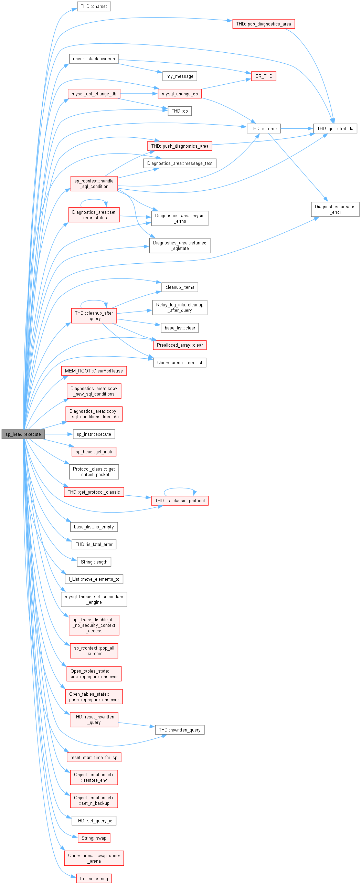

# Store Procedure

## sp_head 类

存储过程对应的核心执行类

```cpp
/**
  sp_head represents one instance of a stored program. It might be of any type
  (stored procedure, function, trigger, event).
*/

核心成员:
/// The SP-instructions.
Mem_root_array<sp_instr *> m_instructions;  // 包含着 sp 对应的所有语句块
```

sp_head::execute call graph



execute 会调用各 sp_instr 的 execute 方法，完成 sp 的执行流程

## sp_instr 类


### 简单介绍

sp_instr: 存储过程指令基类

sp_lex_instr: 初始化需要 LEX 对象，用于解析表达式（内部涉及其他SQL表达式的，都需要继承这个类，因为要在运行过程中执行对应的SQL）

> sp_lex_instr keeps LEX-object to be able to evaluate the expression.

sp_lex_branch_instr: 在 lex_instr 基础上添加了跳转能力，执行SQL语句，计算结果，判定跳转

> sp_lex_branch_instr is a base class for SP-instructions, which might perform conditional jump depending on the value of an SQL-expression.

## find handler 逻辑解析

```cpp

/* 入参分析：
sql_state -> 错误信息对应的 sqlstate
sql_errno -> 错误信息对应的 errno
severity  -> 严重程度，一个错误码也可能对应多个严重程度，同一个错误码既可能是报错，也可能是告警
*/

sp_handler *sp_pcontext::find_handler(
    const char *sql_state, uint sql_errno,
    Sql_condition::enum_severity_level severity) const {
  sp_handler *found_handler = nullptr;
  const sp_condition_value *found_cv = nullptr;

  for (size_t i = 0; i < m_handlers.size(); ++i) {  // 顺序遍历所有的 handler
    sp_handler *h = m_handlers.at(i);

    List_iterator_fast<const sp_condition_value> li(h->condition_values);
    const sp_condition_value *cv;

    /*
    注意：find逻辑中，找到了对应匹配的 condition/handler 也不会终止判断，而且继续遍历，因为可能会找到更高优先级的。

    优先级是通过枚举大小值判断的， errno > sqlstate > other.
    wanring/not_found/exception之间是没有优先级的概念的(其实有也无所谓,因为这三个条件对应的sqlstate不存在交集)

    可以总结为：
    1. 单层内的多个handler，选取逻辑： 1.匹配 2.优先级高 (此处是不用担心同一优先级的多个同时命中的，因为 handler 在创建的时候(语法解析层)，
    已经限制了不能出现重复的条件(但是对于互相包含的这种是不会检测的，比如sqlstate包含errno)，所以同类型命中仅会有一个)
    2. 如果单层上下文内 已经匹配到了 handler，将会返回！而不是会继续向上层寻找匹配度更高的 handler
    即：当前层已经匹配到了 sqlwarning，但是上层其实存在一个更高优先级，errno相等的，也不会继续向上层寻找了。
    */
    while ((cv = li++)) {  // 顺序遍历 handler 内的所有 condition
      switch (cv->type) {
        case sp_condition_value::ERROR_CODE:  // cv 为错误码类型
          if (sql_errno == cv->mysqlerr &&
              (!found_cv || found_cv->type > sp_condition_value::ERROR_CODE)) {  // 注意：当找到了对应的cv条件，如果优先级小于 error_code，还是会覆盖found_cv 
            found_cv = cv;
            found_handler = h;
          }
          break;

        case sp_condition_value::SQLSTATE:
          if (strcmp(sql_state, cv->sql_state) == 0 &&
              (!found_cv || found_cv->type > sp_condition_value::SQLSTATE)) {  // sqlstate，也存在优先级判断
            found_cv = cv;
            found_handler = h;
          }
          break;

        case sp_condition_value::WARNING:
          if ((is_sqlstate_warning(sql_state) ||
               severity == Sql_condition::SL_WARNING) &&
              !found_cv) {  // warning -> sqlstate 01xxx， 注意：这边判断有个条件，只要严重等级是 warning 就可以算作匹配！因为errno、sqlstate都不与严重程度绑定！
            found_cv = cv;
            found_handler = h;
          }
          break;

        case sp_condition_value::NOT_FOUND:
          if (is_sqlstate_not_found(sql_state) && !found_cv) {  // not_found -> 02xxx
            found_cv = cv;
            found_handler = h;
          }
          break;

        case sp_condition_value::EXCEPTION:
          if (is_sqlstate_exception(sql_state) &&
              severity == Sql_condition::SL_ERROR && !found_cv) {  // exception -> [0] != 0 || [1] > 2
            found_cv = cv;
            found_handler = h;
          }
          break;
      }
    }
  }

  if (found_handler) return found_handler;

  // There is no appropriate handler in this parsing context. We need to look up
  // in parent contexts. There might be two cases here:
  //
  // 1. The current context has REGULAR_SCOPE. That means, it's a simple
  // BEGIN..END block:
  //     ...
  //     BEGIN
  //       ... # We're here.
  //     END
  //     ...
  // In this case we simply call find_handler() on parent's context recursively.
  //
  // 2. The current context has HANDLER_SCOPE. That means, we're inside an
  // SQL-handler block:
  //   ...
  //   DECLARE ... HANDLER FOR ...
  //   BEGIN
  //     ... # We're here.
  //   END
  //   ...
  // In this case we can not just call parent's find_handler(), because
  // parent's handler don't catch conditions from this scope. Instead, we should
  // try to find first parent context (we might have nested handler
  // declarations), which has REGULAR_SCOPE (i.e. which is regular BEGIN..END
  // block).

  const sp_pcontext *p = this;

  /* m_scope 分两种：handler 和 regular，第一种代表 handler，第二种代表 普通的begin end，
  对应一个 handler 结构，其会对应两个ctx，handler的语句-> handler_scope, handler 的 begin 块，对应的是 regular.

  当其发现我当前 ctx 类型是 handler，就会设置为 parent，即声明 handler 的那一层（handler生效的那一层）
  最终直到 p 不为 handler scope
  */
  while (p && p->m_scope == HANDLER_SCOPE) p = p->m_parent;

  if (!p || !p->m_parent) return nullptr;

  /* 注意：此处是寻找当前层的 parent 的 handler 
  当之前是 handler 类型的上下文时，p 已经被设置为了最近的 非handler 的ctx，
  此时再获取 p->m_parent，这时的 ctx 就是 handler生效的 ctx 的 父 ctx，这也就解释了
  为什么当一层中存在两个handler，如果 handler1命中，处理过程中发生错误X，而 handler2所捕获的错误正好为 X，此时不会命中 handler2.
  因为在find过程中已经设置上下文为 handler 生效的 ctx 的 父ctx 了。

  通过这个实现，我猜测他的设计理念就是：handler 处理过程中发生的错误，其实并不是我预期的，如果是我预期的，那么 handler 内部就会有新 handler 了，
  没有的话，handler 处理报错就是一个非预期的，此时同层的 handler 捕获的话，业务含义就很奇怪，所以设计成了直接向上层暴露，由上层去处理底层 handler 的报错，
  因为此时底层 handler 上层是不感知的，他就和普通代码是没有差异的。
  */
  return p->m_parent->find_handler(sql_state, sql_errno, severity);
}
```

总结一下相关逻辑：

1. 同层内多个 handler 全部要遍历，谁匹配且优先级高，选谁。
2. 同层判定完，有就返回，没有继续找 parent
3. 如果当前层是 handler，寻找第一个 非handler 层的 parent

## keyword

sp - store procedure  存储过程
instr - instruction  指令