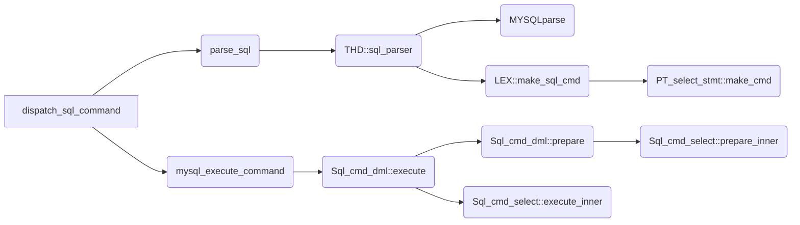

# graph

## dispatch_sql_command

```mermaid
graph LR
A[dispatch_sql_command] -->B(parse_sql)
A -->C(mysql_execute_command)
B -->B1(THD::sql_parser)
B1 -->B11(MYSQLparse)
B1 -->B12(LEX::make_sql_cmd)
B12 -->B121(PT_select_stmt::make_cmd)

C-->C1(Sql_cmd_dml::execute)
C1-->C11(Sql_cmd_dml::prepare)
C1-->C12(Sql_cmd_select::execute_inner)

C11-->C111(Sql_cmd_select::prepare_inner)
```