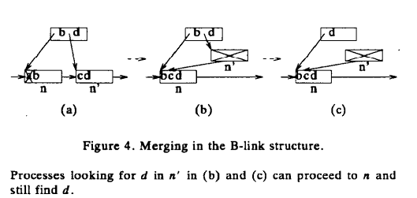
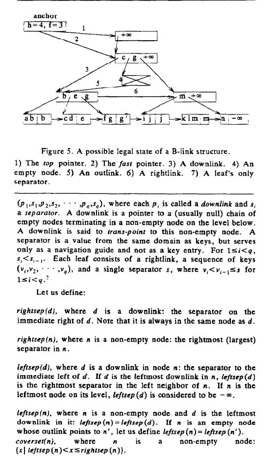

# A SYMMETRIC CONCURRENT B-TREE ALGORITHM

## ABSTRACT

> 基于L&Y提出的Btree并发插入算法，提出一种对称的删除算法，使Btree有更好的并发性能

## 1.INTRODUCTION

### 1.1 Previous Work

略

### 1.2 The Lehman and Yao Algorithm and Deletions

基于B+树，L&Y提出了B-link树，队每个level都使用单向指针连接。

> Although it is not apparent in [Lehman, Yao 811 itself, the B-link structure allows inserts and searches to lock only one node at a time. This is fully utilized in algorithms in [Sagiv 8.51 and [Shasha 841]. 

L&Y算法的问题就是不考虑删除，多次删除之后，结构也不会缩小，需要离线重建。

### 1.3 Symmetric Deletion Approach

two possibilities in merge n and n'

提出通过merge解决问题，发现n'为空，可以根据link去n上获取数据

## 2.OUR ALGORITHM

### 2.2 Locks

L&Y算法中假定读写都是一个不可分割的原子操作，但是并不是很合理。所以本文做了简单的改造。

2种锁：S\X，有S才能进行非修改操作，有X才能进行修改操作

每个action当descent时不会同时获取超过1个S，当ascent时insert不会获取超1个X，并且1个删除ascent时不会获取超2个X

### 2.3 The Locate Phase and the Decisive Operation（定位阶段和关键操作）

